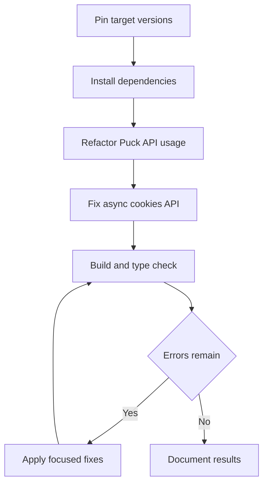

# Next.js 15.5.7 Upgrade Build Fix Plan

## Confirmed issues from logs
- Import API mismatch in [`Grid.tsx`](frontend/src/components/blocks/Grid.tsx) using [`Puck.DropZone`](frontend/src/components/blocks/Grid.tsx:45), which is not exported in the installed API shape.
- Next 15 async cookies typing issue in [`isUserAuthorized()`](frontend/src/lib/auth.ts:9) where [`cookies()`](frontend/src/lib/auth.ts:12) is treated as sync and then `.has` is called.
- Version alignment requested: upgrade [`next`](frontend/package.json:19) to `15.5.7`.
- Strategy confirmed: upgrade [`@measured/puck`](frontend/package.json:14) to latest compatible and refactor for long-term compatibility.

## Actionable todo list
- [ ] Update dependency versions in [`package.json`](frontend/package.json) for [`next`](frontend/package.json:19), [`eslint-config-next`](frontend/package.json:28), and [`@measured/puck`](frontend/package.json:14) to compatible latest targets.
- [ ] Regenerate lockfile and install updated dependencies from [`package-lock.json`](frontend/package-lock.json).
- [ ] Refactor Puck block integration in [`Grid.tsx`](frontend/src/components/blocks/Grid.tsx) to remove unsupported [`Puck.DropZone`](frontend/src/components/blocks/Grid.tsx:45) usage and replace with the current recommended composition API for nested content.
- [ ] Validate and adjust related Puck config typings/usages in [`puck.config.tsx`](frontend/src/puck.config.tsx:29) to match the upgraded package types.
- [ ] Fix Next.js 15 async request API usage in [`isUserAuthorized()`](frontend/src/lib/auth.ts:9) by awaiting [`cookies()`](frontend/src/lib/auth.ts:12) and preserving behavior.
- [ ] Run production build and type checks to confirm no regressions.
- [ ] Resolve any newly surfaced build/type issues introduced by dependency upgrades, prioritizing minimal and safe fixes.
- [ ] Verify editor and render routes still function with updated Puck runtime in [`/edit/[...slug]/page.tsx`](frontend/src/app/edit/[...slug]/page.tsx:12) and [`/page.tsx`](frontend/src/app/page.tsx:6).
- [ ] Produce concise change summary and migration notes for the Next and Puck upgrade.

## Execution flow

## Handoff guidance for implementation mode
- Perform edits in source files first, then dependency install/build validation.
- Keep behavioral changes minimal outside required API migrations.
- Treat build success as done criteria, not just compile warning reduction.
